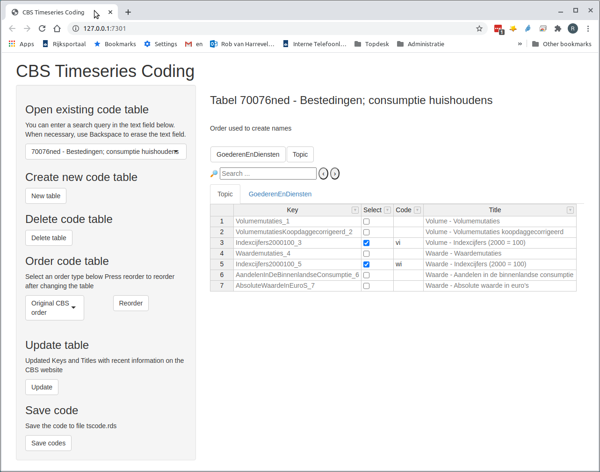
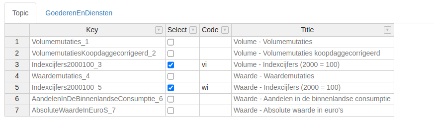
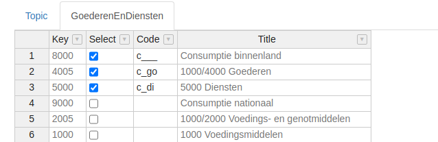
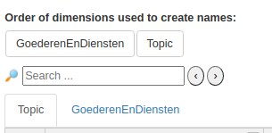
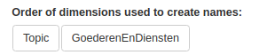

---
output:
  github_document: default
  html_document: default
---
<!-- README.md is generated from README.Rmd. Please edit that file -->

---
output: github_document
title: cbsots
author: "Rob van Harrevelt"
date: '`r Sys.Date()`'
---

```{r include = FALSE}
library(cbsots)
file.copy("readme_data/tscode.rds", "tscode.rds")
```

[](https://travis-ci.org/timemod/cbsots)


Retrieve timeseries from the [CBS open data interface](http://www.cbs.nl/nl-NL/menu/cijfers/statline/open-data/default.htm)
interface, employing package [cbsodataR](https://github.com/edwindj/cbsodataR).

# Introduction

Package [cbsodataR](https://github.com/edwindj/cbsodataR) can be used
to retrieve data of CBS tables using R code. Most tables are complex multi-dimensional tables,
and extracting timeseries with appropriate names will usually require 
some further R programming. The purpose of `cbsots` is to take this programming off your hands.

The packages provides the Shiny App "CBS Timeseries Coding" for specifying which portions
of the table you want to retrieve and how the names of the individual timeseries
(the so-called "timeseries coding") should be constructed, and a separate 
function `get_ts` for actually creating the timeseries based on the timeseries 
coding created with the Shiny App.

The workflow when using package `cbsots` to retrieve timeseries thus consists 
of two separate steps:

1. Create or modify the timeseries coding for one or more CBS tables with Shiny App 
"CBS Timeseries Coding". The timeseries coding is stored in an rds file.
2. Use function `get_ts` to retrieve the timeseries, using the timeseries coding
read from the rds file created in step 1.

Step 1 (using the Shiny App) is only necessary if you add a new table, or if you want 
to modify the timeseries coding for an existing table.

# Installation

```{r, eval = FALSE}
# first install library drat if you have not installed that library yet:
install.packages("drat")

# now install cbsots with the timemod drat Repository
drat::addRepo("timemod")
install.packages("cbsots")
```

# The Shiny App "CBS Timeseries Coding"

The Shiny application is started by calling the function `edit_ts_code`.
For example, 
```{r eval = FALSE}
library(cbsots)
edit_ts_code("tscode.rds")
```

The first argument (`"tscode.rds"`) specifies the name of the rds file where the 
timeseries coding is stored. The file does not have to exist yet. If it does
not exist, then the file is created when the timeseries coding is saved.

More information about the Shiny App "CBS Timeseries Coding" will be provided in 
the  ([*cbsots Tutorial*](pkg/vignettes/cbsots_tutorial.pdf)).
In this README file the Shiny App will be presented briefly to give you
an idea about the basic functionality. Here is an example of the Shiny App with already 
specified timeseries coding for table `70076NED` (consumption
in the Netherlands) (some texts are quite small and may be difficult to read,
but below I will zoom in on relevant parts of the Shiny App):



The left panel contains several buttons. The right panel shows, among others,
two tabs containing a table. Let us have a closer look at the table in the
selected tab:



CBS table `70076NED`  contains two dimensions: "Topic" and "GoederenEnDiensten" (Goods and Services),
besides the time dimension (years, quarters etc.) that is disregarded in the Shiny App. 
Every CBS table has a dimension called "Topic", and usually has one or more extra dimensions,
such as "GoederenEnDiensten" for this table.

For this particular table, the different "Topics" correspond to different types of 
consumption timeseries, for example volumemutaties (volume changes), waardemutaties (value changes),
and indexcijfers (indices) for both volume and value.
Each Topic has a *Key* (a short identifier)
and a *Title* (a more detailed description). The *Select* and *Code* columns are the
columns that can be modified. In this example, we are only interest in indices
for both volumes and values, so only the corresponding entries have been selected.
The text in the Code column is used to create the timeseries
names, as explained below.

In the next figure the table for dimension "GoederenEnDiensten" (Goods and Services)
is shown:



For this dimension, I have selected  "Consumptie binnenland" (domestic consumption),
"Goederen" (Goods) and "Diensten" (Services).

Function `get_ts` will create a timeseries for each   combination of selected 
"Topic" and "GoederenEnDiensten".
The names of the timeseries are created by pasting the texts in the Code columns 
for each combination of "Topic" and "GoederenEnDiensten".
In this case, the codes for "Topic" are the suffixes and the
codes for "GoederenEnDiensten" are the prefixes. So the names of the timeseries
will be `c___vi`, `c_govi`, `c_divi`,  `c___wi`, `c_gowi`, `c_divi`. 
Which dimension is used for the prefixes and which dimension for the suffixes 
of the timeseries names is determined by the ordering of the buttons above the
tabs with dimension table, above the Search text field. 
See the selection of the Shiny App below:



The ordering the these buttons can be changed in the Shiny App: 
move the mouse cursor to the button `GoederenEnDiensten`,
then press the left mouse button and drag it to the right of button `Topic`. Now you can release
the button. As a result you would get:



For this ordering, the timeseries names would become `vic___`, `vic_go `, 
etc.

After making any changes to the timeseries coding, you should press the
`Save codes` button on the lower left corner of the Shiny App.
The Shiny App does not automatically save changes.

# Function get_ts

To create the timeseries, first read the timeseries coding created by the
Shiny App:
```{r}
ts_code <- readRDS("tscode.rds")
```

Then function `get_ts` can be used to finally create the timeseries:

```{r}
# Return only yearly and quarterly series (skip monthly series) and 
# for years 2017 and later
data <- get_ts("70076NED", ts_code, frequencies = "yq",
               min_year = "2017")
```

The result is a list with class `table_ts`, with components `"Y"` (annual timeseries)
and `"Q"` (quarterly timeseries):
```{r}
data
```

```{r echo = FALSE}
unlink("raw_cbs_data", recursive = TRUE)
unlink("tscode.rds")
```

# Further Documentation

[Reference manual](cbsots.pdf)

[Vignette *cbsots Tutorial*](pkg/vignettes/cbsots_tutorial.pdf)
