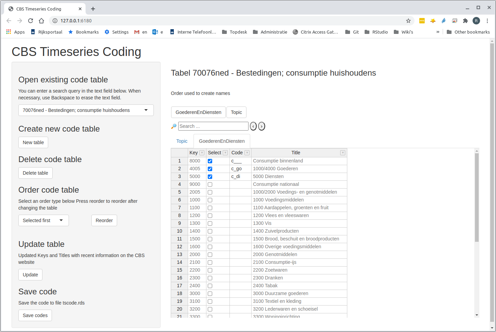
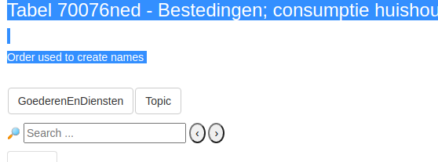

<!-- README.md is generated from README.Rmd. Please edit that file -->

# cbsots

[](https://travis-ci.org/timemod/cbsots)

Retrieve timeseries from the [CBS open data
interface](http://www.cbs.nl/nl-NL/menu/cijfers/statline/open-data/default.htm)
interface, employing package
[cbsodataR](https://github.com/edwindj/cbsodataR)

## Introduction

Package [cbsodataR](https://github.com/edwindj/cbsodataR) can be used to
retrieve data of CBS tables using R code. Most tables are complex
multi-dimensional tables, and extracting timeseries with appropriate
names will usually require some further R programming. The purpose of
`cbsots` is to take this programming off your hands.

The packages provides the Shiny App “CBS Timeseries Coding” for
specifying which portions of the table you want to retrieve and how the
names of the individual timeseries should be constructed, and a separate
function `get_ts` for actually creating the timeseries based on the
timeseries coding created with the Shiny App. The timeseries coding
created in the Shiny App is stored in an rds file.

## Installation

``` r
# first install library drat if you have not installed that library yet:
install.packages("drat")

# now install cbsots with the timemod drat Repository
drat::addRepo("timemod")
install.packages("cbsots")
```

## The Shiny App "CBS Timeseries Coding\`

The Shiny application is started by calling the function `edit_ts_code`.
For example,

``` r
library(cbsots)
edit_ts_code("tscode.rds")
```

The first argument (`"tscode.rds"`) specifies the name of the rds file
were the timeseries coding is stored. The file does not have to exist
yet. If it does not exist, then the file is created when the timeseries
coding is saved.

More information about the Shiny App “CBS Timeseries Coding” will be
provided in a future Tutorial and a Manual, which unfortunately still
have to be written. Here I only give a simple example for a table
`70076NED` (consumption in the Netherlands).

The Shiny App looks like this:

 This table
has two dimensions: “Topic” and “GoederenEnDiensten” (Goods and
Services), besides of the time dimension (years, quarters etc.) that is
disregarded in the Shiny App. Every CBS table has a dimension called
“Topic”, and usually has one or more extra dimensions, such as
“GoederenEnDiensten” for this table. For this particular table, the
different Topics correspond to different types of consumption
timeseries: volumemutaties (volume changes), waardemutaties (value
changes), and indexcijfers (indices) for both volume and value. Each
Topic has a *Key* (a short identifier) and a *Title* (a more detailed
description). The Select and Code columns are the columns that can be
modified. In this example, we are only interest in indices for both
volume and value, so only the corresponding entries have been selected.
The text in the *Code* column is used to create the timeseries names, as
explained below.

Let us now have a look at the tab `GoederenEnDiensten`:



Here we have selected “Consumptie binnenland” (domenstic consumption),
“Goederen” (assets) and “Dientsten” (services). Note that in this case
all selected entries appear first, before the entries that have not been
selected. That is because for this tab we have below “Order code table”
(on the left side of the App) for “Selected First”. In this case this is
useful, because the entry with Key 5000 is quite far appart from the
other entries in the table.

#### Timeseries names

Function `get_ts` will create a timeseries for each  
combination of selected “Topics” and “GoederenEnDiensten”. The names of
the timeseries are created by pasting the texts in the Code columns for
each dimension. In this case, the codes for “Topic” are the suffixes and
the codes for `GoederenEnDiensten` are the prefixes. So the names of the
timeseries will be `c___vi`, `c_govi`, `c_divi`, `c___wi`, `c_giwi`,
`c_divi`. Which dimension becomes the suffix and which dimension the
prefix is determined by the ordering of the buttons `GoederenEnDiensten`
and `Topic` above the table of keys and title (see the selection of the
Shiny App below).



This ordering the these buttons can be changed: mouse the mouse cursor
to the button `GoederenEnDiensten`, then press the left mouse button and
drag it to the right of button `Topic`. Now you can release the button.
The result is that the `Topic` button appears to left of de
`GoederenEnDiensten` button. Then the timeseries names would become
`vic___`, `vic_di`, etc.

#### Saving changes

A note: to save any changes made in the timeseries table, press the
button “Save” to the left. The Shiny App does not automatically save
changed.

## Function get\_ts

To create the timseries, we first read the timeseries coding created by
the Shiny App:

``` r
ts_code <- readRDS("tscode.rds")
```

Then function `get_ts` can be used to finally create the timeseries:

``` r
# Return only yearly and quarterly series (skip monthly series) and 
# starting from 2017
data <- get_ts("70076NED", ts_code, frequencies = "yq",
               min_year = "2017")
```

    ## Downloading table 70076ned ...
    ## Filters:
    ## $Perioden
    ##  [1] "2017KW01" "2017KW02" "2017KW03" "2017KW04" "2017JJ00" "2018KW01"
    ##  [7] "2018KW02" "2018KW03" "2018KW04" "2018JJ00" "2019KW01" "2019KW02"
    ## 
    ## $GoederenEnDiensten
    ## [1] "      8000" "      4005" "      5000"

    ## Retrieving data from table '70076ned'

    ## http://opendata.cbs.nl/ODataFeed/odata/70076ned/TypedDataSet?$format=json&$filter=(Perioden%20eq%20'2017KW01'%20or%20Perioden%20eq%20'2017KW02'%20or%20Perioden%20eq%20'2017KW03'%20or%20Perioden%20eq%20'2017KW04'%20or%20Perioden%20eq%20'2017JJ00'%20or%20Perioden%20eq%20'2018KW01'%20or%20Perioden%20eq%20'2018KW02'%20or%20Perioden%20eq%20'2018KW03'%20or%20Perioden%20eq%20'2018KW04'%20or%20Perioden%20eq%20'2018JJ00'%20or%20Perioden%20eq%20'2019KW01'%20or%20Perioden%20eq%20'2019KW02')%20and%20(GoederenEnDiensten%20eq%20'%20%20%20%20%20%208000'%20or%20GoederenEnDiensten%20eq%20'%20%20%20%20%20%204005'%20or%20GoederenEnDiensten%20eq%20'%20%20%20%20%20%205000')

    ## Done!

The result is a list with class `table_ts`, with com-ponents `"Y"`
(annual timeseries) and `"Q"` (quarterly timeseries):

``` r
data
```

    ## table_ts object
    ## Frequency Y :
    ## Topleft part of the result (the first 6 rows and 10 columns):
    ##      c___vi c___wi c_divi c_diwi c_govi c_gowi
    ## 2017  147.4  111.6  170.9  120.6  124.6  102.5
    ## 2018  153.8  114.4  178.0  123.5  130.3  105.2
    ## Frequency Q :
    ## Topleft part of the result (the first 6 rows and 10 columns):
    ##        c___vi c___wi c_divi c_diwi c_govi c_gowi
    ## 2017Q1  144.9  108.6  167.9  117.6  122.6   99.5
    ## 2017Q2  147.1  111.3  171.6  120.6  123.3  101.8
    ## 2017Q3  145.8  111.0  172.5  121.6  119.7  100.3
    ## 2017Q4  153.8  115.6  171.8  122.5  136.2  108.7
    ## 2018Q1  151.5  111.8  174.5  120.4  129.3  103.2
    ## 2018Q2  153.5  114.2  178.8  123.7  128.8  104.4

## Examples

## Further Documentation

[Reference manual](cbsots.pdf)

<!--
[Vignette](pkg/vignettes/cbsots.pdf)
-->
