<!--
%\VignetteEngine{knitr::bookdown}
%\VignetteIndexEntry{Tutorial for package cbsots}
-->

```{r echo = FALSE, message = FALSE}
knitr::opts_chunk$set(collapse = FALSE, comment = "", prompt = TRUE)
```

# Introduction

Package [cbsodataR](https://github.com/edwindj/cbsodataR) can be used
to retrieve data from the [CBS open data interface](http://www.cbs.nl/nl-NL/menu/cijfers/statline/open-data/default.htm)
Most tables are complex multi-dimensional tables,
and extracting timeseries with appropriate names will usually require 
some further R programming. The purpose of `cbsots` is to take this programming off your hands.

The packages provides the Shiny App "CBS Timeseries Coding" for specifying which portions
of the table you want to retrieve and how the names of the individual timeseries
(the so-called "timeseries coding") should be constructed, and a separate 
function `get_ts` for actually creating the timeseries based on the timeseries 
coding created with the Shiny App.

The workflow when using package `cbsots` to retrieve timeseries thus consists 
of two separate steps:

1. Create or modify the timeseries coding for one or more CBS tables with Shiny App 
"CBS Timeseries Coding". The timeseries coding is stored in an rds file.
2. Use function `get_ts` to retrieve the timeseries, using the timeseries coding
read from the rds file created in step 1.

Step 1 (using the Shiny App) is only necessary if you add a new table, or want 
to modify the timeseries coding for an existing table.

In this tutorial, an example of this approach is presented.
You can follow this tutorial step by step. 

# Table 70076ned: consumption households \label{sec:table_70076ned}


For this tutorial we will use CBS table `70076ned`, that contains the consumption
of households in the Netherlands for different kinds of goods
and services. The table contains different types of
consumption timeseries, such as volume changes, value changes,
volume indices and value indices. 

The language of this table is Dutch.
Package `cbsots` currently only supports Dutch tables. There are a few
English table provided by the CBS open data portal, 
but the overwhelming majority of the tables are only provided in Dutch. 
In this tutorial, the timeseries names that we use will also be based
on Dutch terminology, because most users of package `cbsots` are familiar with 
naming conventions based on the Dutch terminology.

The aim of this tutorial is to retrieve the following six timeseries:

Name    | Dutch Description                          | English Description
----    | ------------------                         | -------------------
`c___vi` | Totale consumptie, volume-indexcijfers    | Total consumption, volume indices
`c_divi` | Consumptie diensten, volume-indexcijfers  | Consumption of services, volume indices
`c_govi` | Consumptie goederen, volume-indexcijfers  | Consumption of goods, volume indices
`c___wi` | Totale consumptie,   waarde-indexcijfers   | Total consumption, value indices
`c_diwi` | Consumptie diensten, waarde-indexcijfers   | Consumption of services, value indices
`c_gowi` | Consumptie goederen, waarde-indexcijfers   | Consumption of goods, value indices

Table: Table 1: Names of the timeseries that we want to retrieve from table `70076ned`

All indices have base year 2000, so the timeseries have the value 100 in 2000.

# Starting the the Shiny App

In the remaining part of this Tutorial, I will show how to obtain these timeseries
using `cbosts`. You can follow all examples step by step. Because
the examples will create an rds file with timeseries coding, I recommend you to
run the R code from a clean working directory and 
set the working directory to this new directory, 
for example using R command `setwd`.

The first step is to start the Shiny App with function `edit_ts_code`:
```{r, eval = FALSE}
library(cbsots)
edit_ts_code("tscode.rds")
```
The first argument (`"tscode.rds"`) specifies the name of the rds file in the
current working directory in which the timeseries coding is stored. 
The file should not exist yet at this point. 
The Shiny App should now open in your internet browser:

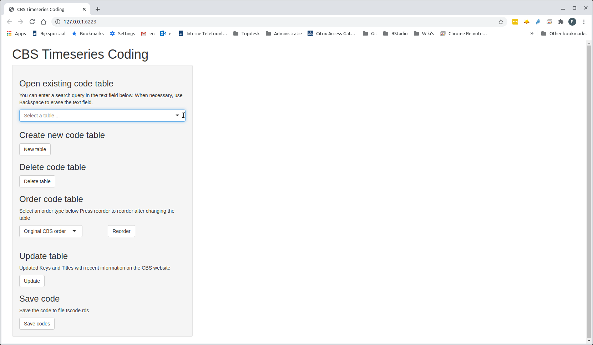

# Creating a new table in the Shiny App

Since the file `"tscode.rds"` does not exist yet, there are no existing code 
tables yet. To create the timeseries coding for table `70076ned`,
press the `New table` button
underneath the text "Create new code table". After a while,
a window titled "New table" (see the picture below) appears, which allows you 
to select from the list of available
tables. There is some delay between the moment that you press the button and
when the window appears, because a list of available tables has to be downloaded
from the CBS website.

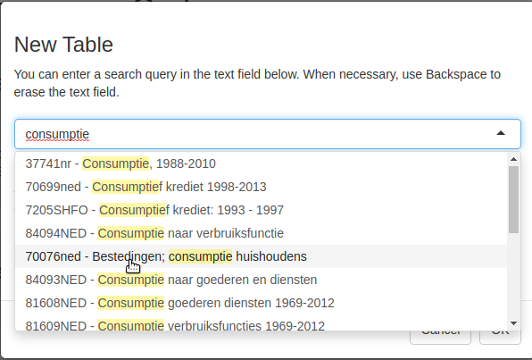

In the drop down list, you can enter a search query, for 
example  `"consumptie"` (see the picture above). Now a list 
of table titles containing the word `"consumptie"` appears. 
Alternative, you could also have entered the search query `"70076"` to obtain
a list of tables containing "70076" in the title (there is only one such table).
From the list, select  `"70076ned - Bestedingen; consumptie huishoudens"`.
Do not specify the base table^[The use of the base table will be described in 
vignette "The CBS Timeseries Coding Shiny App", which unfortunately still has 
to be written] in the second drop down list, and press the 
`OK` button (see below):

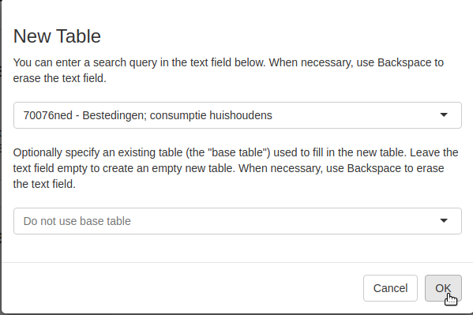


Now information about table `"70076ned"` will be displayed in the Shiny App 
(some texts are quite small and may be difficult to read,
but below I will zoom in on relevant parts of the Shiny App):

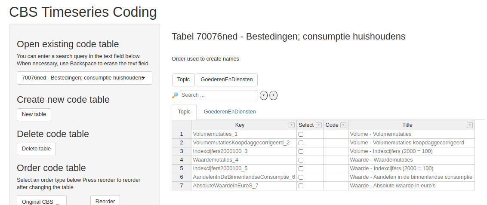

The right panel shows, among others, two tabs containing a table. Let us have 
a closer look at the table in the selected tab:


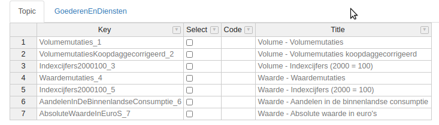

CBS table `70076ned`  contains two dimensions: "Topic" and "GoederenEnDiensten" (Goods and Services),
besides the time dimension (years, quarters etc.) that is disregarded in the Shiny App. 
Every CBS table has a dimension called "Topic", and usually has one or more extra dimensions,
such as "GoederenEnDiensten" for this table.

For this particular table, the different "Topics" correspond to different types of 
consumption timeseries, for example volumemutaties (volume changes), waardemutaties (value changes),
and indexcijfers (indices) for both volume and value.
Each Topic has a *Key* (a short identifier)
and a *Title* (a more detailed description). The *Select* and *Code* columns are the
columns that can be modified.

In the next figure, the  upper part of the table for dimension "GoederenEnDiensten" (Goods and Services)
is shown. This table is quite long (there are 38 rows), but only the first seven
rows are shown. Here find entries for among others,  "Consumptie binnenland" (domestic consumption),
"Goederen" (Goods), "Voedingsmiddelen" (nourishment), and "Aardappelen, groenten, en fruit" 
(potatoes, vegetables and fruit).

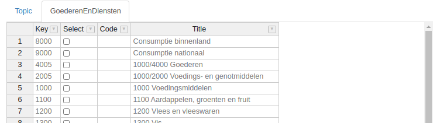

# Selecting dimension keys

This table contains 7 Topic and 38 entries for dimensions "GoederenEnDiensten",
so there are 266 timeseries available for this table. 
As explained in section \ref{sec:table_70076ned}, we are only interested in a 
subset of 6 timeseries. The Select columns in the tables for "Topic" and
"GoederenEnDiensten" determine which timeseries are downloaded.

We are only interested in volume and value indices, so we start by selecting
the corresponding Topics (move the mouse to the square and press the left mouse
button):

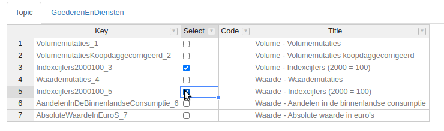

For the dimension "GoederenEnDiensten", select 
the rows with titles `Consumptie binnenland` (domestic consumption).
`1000/4000 Goederen` (Goods)  and `5000 Diensten` (Services). To select the 
latter row, scroll down the table.

Because the selected rows for dimension "GoederenEnDiensten" are quite far 
apart in the table, we cannot see  at one glance which rows have been selected. 
It is possible to change the order of the rows so that selected rows appear 
first. On the left panel of the Shiny App, underneath the text 
"Order code table", you can select the ordering type: "Original CBS order" 
(original order of selected table) or "Selected first" (selected rows appear 
first). See the figure below:

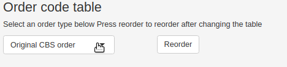

After changing the order from "Original CBS order" to "Selected first", the result is:

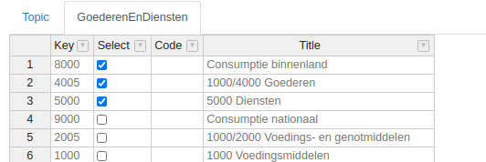

If you select another row, for example the row with Title "2000 - Genotmiddelen",
then the ordering does not change immediately. Press the button `Reorder` to
reorder the table again, so that all selected rows appear first in the table.

# Specifying the Code 

The next step is to fill in the Code columns, which are
used to create timeseries names. 
The names of the timeseries are constructed by pasting the texts in the Code
columns  for each combination of "Topic" and "GoederenEnDiensten".

As explained in Section \ref{sec:table_70076ned}, the names of the timeseries
that we want to create should have a prefix based on the type of 
"GoederenEnDiensten" (Goods and Services):  `c___ `   (total consumption), 
`c_go` (goods), and `c_di ` (services). We also want suffix `vi` for volume indices
and `wi` for value indices.
However, by default, the texts in the code column for "Topic" are the 
prefixes, and code for the second dimension (here "GoederenEnDiensten")
the suffixes.^[If a table has more than two dimension, the code for the
intermediate dimensions are used as infixes]. Which dimension is used for the 
prefixes and which dimension for the suffixes, is determined by the ordering of 
the buttons above the
tabs with dimension table, above the Search text field. 
See the selection of the Shiny App below:

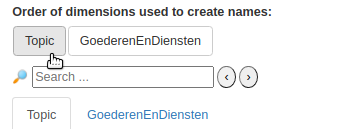

The ordering the these buttons can be changed in the Shiny App: 
move the mouse cursor to the button `Topic`,
then press the left mouse button and drag it to the right of button `Topic`. 
Now you can release
the button. As a result you will get:

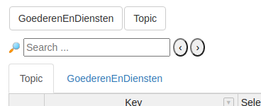

Now fill in the Code columns for selected rows:

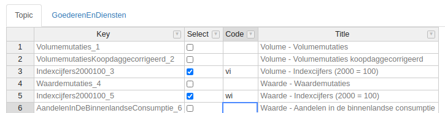

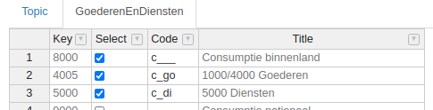


# Saving the timeseries coding

The final step is to save the timeseries coding:
press the `Save codes` buttons on the lower left side of the Shiny App.
Changes are not saved automatically. See the figure below:

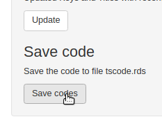

The timeseries coding is saved to file `"tscode.rds"` in the current
working directory.

# The code tables \label{sec:tables}

We are now finished with the timeseries coding for
table `70076ned`. If you select the drop-downlist underneath the
text `Open existing code table`, you will find this table: 

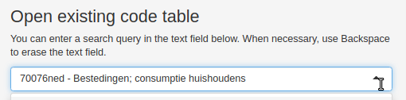

The timeseries coding written to `"tscode.rds"` now contains the timeseries
coding for one table.
We can add another table by pressing the button `New table`. 
In typical applications of `cbsots`, the timeseries coding managed by the 
Shiny App contains about 10-20 tables.

# Retrieving timeseries with get_ts

To create the timeseries, first read the timeseries coding created by the
Shiny App:

```{r include = FALSE}
library(cbsots)
file.copy("tutorial_data/tscode_final.rds", "tscode.rds")
```

```{r}
ts_code <- readRDS("tscode.rds")
```

Then function `get_ts` can be used to finally create the timeseries
for table `"20076ned"`. 
```{r}
data <- get_ts("70076ned", ts_code)
```

Note that the first argument passed to `get_ts` is the identity
of the table (`"70076ned"`). In this example this may seem superfluous,
because the `tscode` contain the timeseries coding for just this table.
However, as explained in Section \ref{sec:tables}, there are typically
multiple tables stored in the timeseries coding object.

The result of `get_ts` is a list with class `table_ts`, with components 
`"Y"` (annual timeseries), `"Q"` (quarterly timeseries) and 
`"M"` (monthly timeseries):

```{r}
data
```

If you are only interested in, for example, annual timeseries, you can specify
argument `frequencies = "Y"`. It is also possible to specify the minimum
year (argument `min_year`). More details are provided in the description of
function `get_ts`.

By default, `get_ts` stores all data downloaded from the CBS in directory
`raw_cbs_data` in the current working directory.
The name of this directory can be specified with
argument `raw_cbs_dir`. If you run `get_ts` a second time, you may notice
that the result appears much faster, because now the data in directory `raw_cbs_data`
is read:
```{r}
data <- get_ts("70076NED", ts_code)
```
By default, `get_ts` only downloads data from the CBS if there is no
data in directory `raw_cbs_data`, or if you 
have modified the timeseries coding with the Shiny App and have selected a key 
that was previously not selected. 
Otherwise, `get_ts` just reads the previously downloaded data.
This behaviour can be changed by specifying argument `refresh = TRUE`. In that
case, data are always downloaded from the CBS website, so that the 
data returned by `get_ts` always contain the most recent values.
For more details, consult the [_Reference Manual_](cbsots_refman.pdf).

```{r echo = FALSE}
unlink("raw_cbs_data", recursive = TRUE)
unlink("tscode.rds")
```
